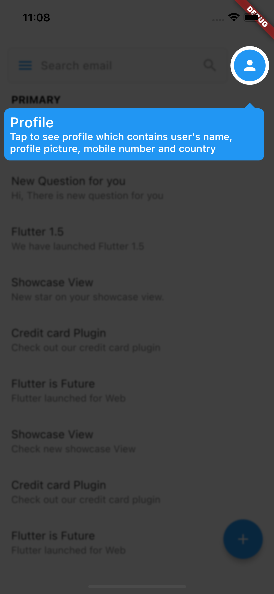
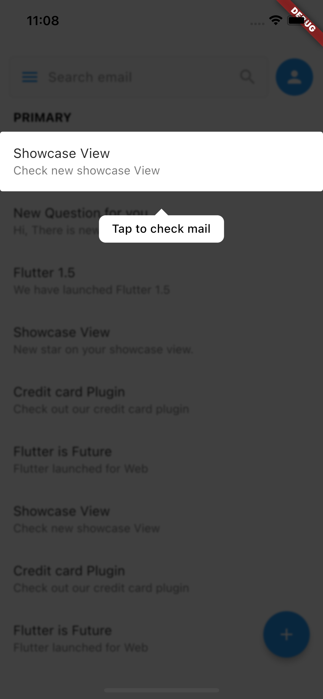
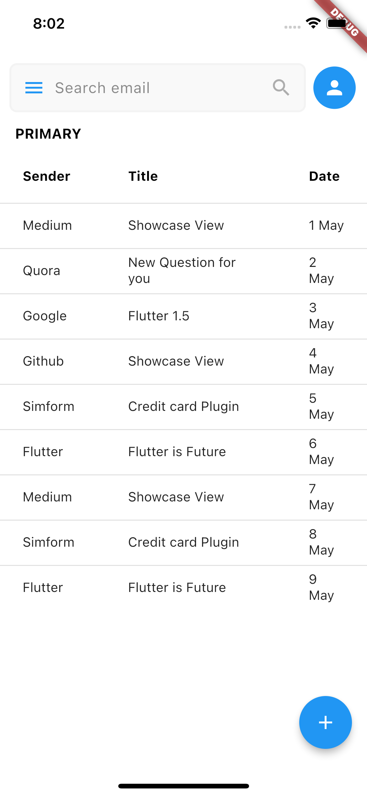

# Flutter Show Case Home New Feature

Easy to create showcase new feature for mobile app android/ios

## Youtube Link

[](https://youtu.be/osYwc9Ofo-0)
https://youtu.be/osYwc9Ofo-0

[](https://youtu.be/6iNkZ3hTaCg)
https://youtu.be/6iNkZ3hTaCg

[](https://youtu.be/5T821x1G1o4)
https://youtu.be/5T821x1G1o4


## Playlist Flutter Intensive Club

https://www.youtube.com/playlist?list=PLQvQbJRJpIZ67MrVzPDOYtAs7wmFjmFUI (https://www.youtube.com/playlist?list=PLQvQbJRJpIZ67MrVzPDOYtAs7wmFjmFUI)

## Roadmap Learing Flutter by Flutter Intensive Club (FIC)

https://miro.com/app/board/uXjVPKAz1i4=/?share_link_id=218530192751 (https://miro.com/app/board/uXjVPKAz1i4=/?share_link_id=218530192751)


## ScreenShot

| picture 1         | picture 2           |
|--------------|----------------|
|  |       |

## Changes Icon & Label Apps
* https://pub.dev/packages/flutter_launcher_icons
* https://romannurik.github.io/AndroidAssetStudio/icons-launcher.html

pubspec.yml
```
dependencies:
  cupertino_icons: ^1.0.2
  flutter:
    sdk: flutter
  flutter_launcher_icons: ^0.11.0
  showcaseview: ^2.0.0+1

dev_dependencies:
  flutter_lints: ^2.0.0
  flutter_test:
    sdk: flutter

flutter_icons:
  android: "launcher_icon"
  ios: true
  image_path: "assets/icons/book.png"
  min_sdk_android: 21 # android min sdk min:16, default 21
```  

## ScreenShot Datatable

| picture 1         | picture 2           |
|--------------|----------------|
|  |       |


## Contact:
* Consultation Flutter and Endorse https://t.me/bahri_bhe
* Youtube: https://youtube.com/@codewithbahri
* Github: https://github.com/bahrie127
* Linkedin: https://linkedin.com/in/bahrie
* Roadmap Flutter: https://youtu.be/e2zMJqDBmoY
* Medium: https://medium.com/@bahri